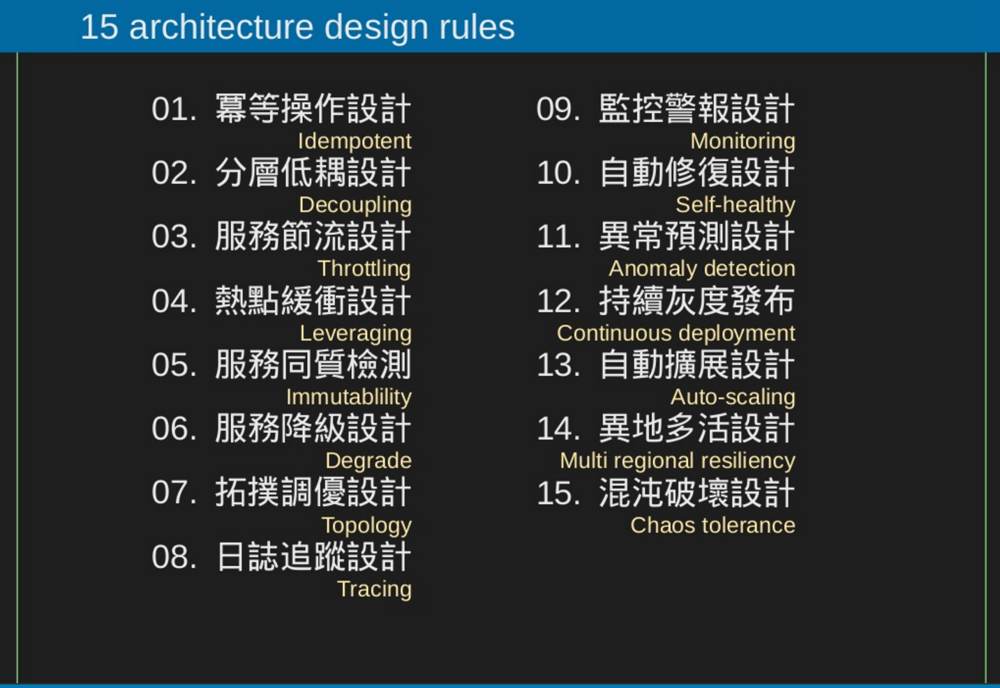

# System Design

### resource
- 
- [System design interview](https://github.com/checkcheckzz/system-design-interview)
- [System design Concept](https://gist.github.com/vasanthk/485d1c25737e8e72759f)
- [Gainlo](http://blog.gainlo.co/)

### list
- [Cache](cache.md)
- [Dead Code Elimination](https://en.wikipedia.org/wiki/Dead_code_elimination)
- [Concepts & Terms](concept.md)

# Network 
- [Network programming初學](http://beej-zhtw-gitbook.netdpi.net/)
- [Network model](network/README.md)

##### Thread Safe
avoid race condition.

### Flow Control

##### Producer Consumer pattern
a

### Multi-Thread
- [java multi-thread](https://popcornylu.gitbooks.io/java_multithread/content/thread.html)

##### Thread pool

### Service

##### HotSpot
trigger quantiies of service in the same time

### 
- [string](string.md)

- Call by other code in protection mode
- Async way
- Memory Limit
- File lock
- Race Condition
- Singleton
- shadow
lazy

